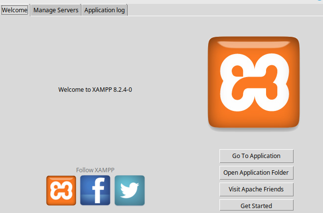
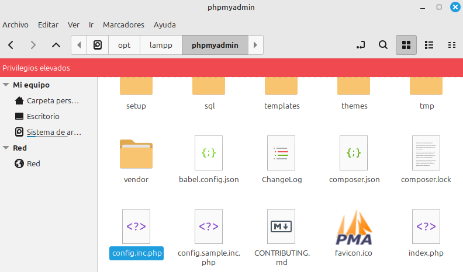
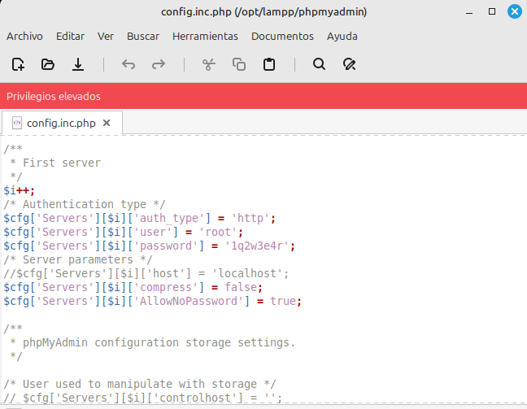
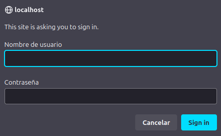
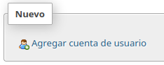
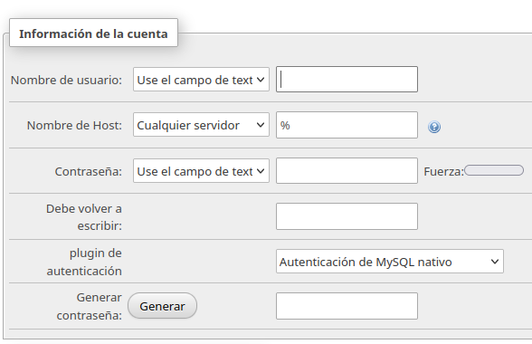
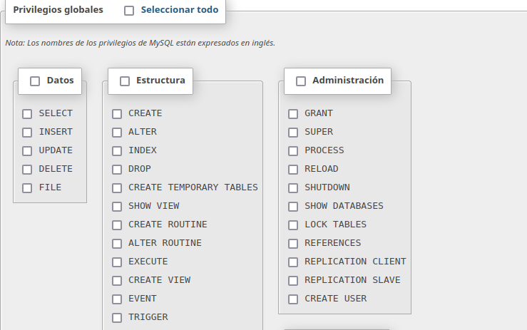

### **Rafael Martín Mayor**

## Seguridad servidor phpmyadmin XAMPP:

### Paso 1:

Abrimos XAMPP y le damos al botón Open Aplication Folder:

### Paso 2:

Buscamos el fichero config.inc.php y lo abrimos:

### Paso 3:

Buscamos donde ponga $cfg['Servers'][$i]['password'] y ponemos la contraseña que deseemos y un poco más arriba buscamos donde ponga $cfg['Servers'][$i]['auth_type'] y ponemos 'http':

Al hacer eso conseguiremos que cada vez que entremos al localhost tengamos que iniciar sesión:

## Crear nuevo usuario:

### Paso 1:

Abrimos el interfaz de phpmyadmin y seleccionamos la opción Cuentas de usuario:
  

### Paso 2:

Una vez ahí bajando le damos a Agregar cuenta de usuario:
  

### Paso 3:

Rellenamos los datos para el usuario:

### Paso 4:

Le damos los permisos que consideremos necesarios y listo:

