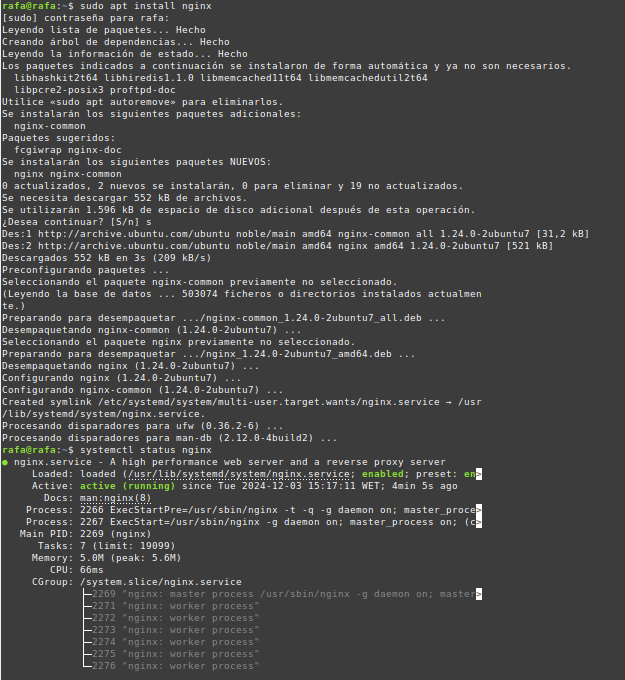
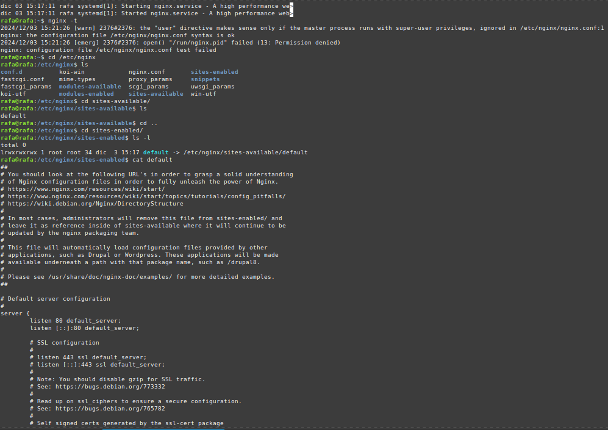
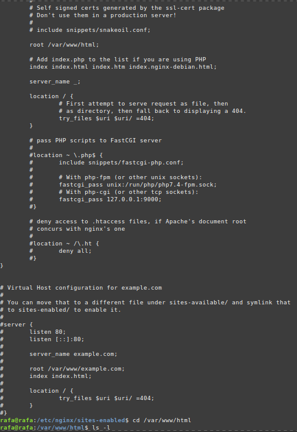
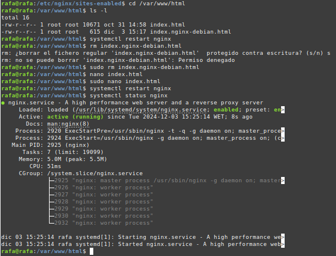

### **Rafael Martín Mayor.**

# **Instalación y configuración básica de nginx.**

- apt install nginx
- systemctl status nginx
- nginx -t
- cd /etc/nginx
- ls    (sale la carpeta de configuración)
- cd sites-available
- ls    (sale default)
- cd sites-enabled
- ls -l
- cat default
- cd /var/www/html
- ls -l
-    (index.nginx-debian.html)
- systemctl restart nginx
- rm index.nginx-debian.html
- nano index.html (guardamos y salimos)
- systemctl restart nginx
- systemctl status nginx

# **Capturas:**

