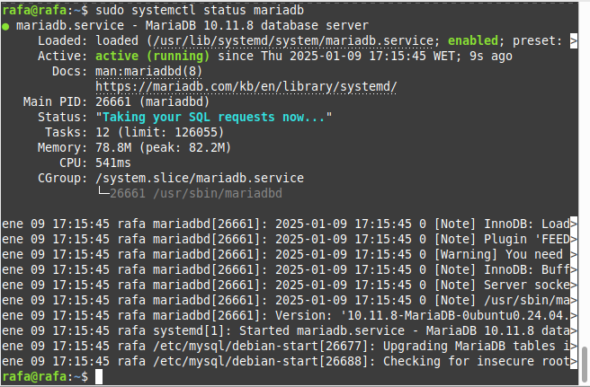
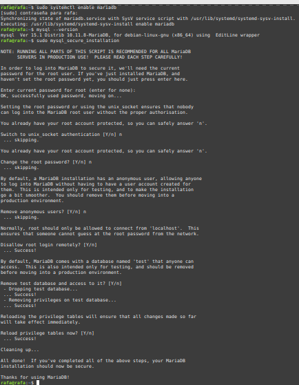
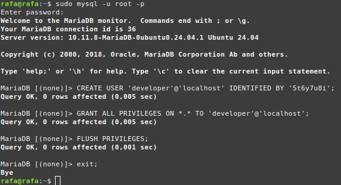
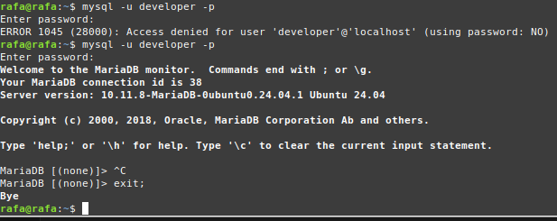
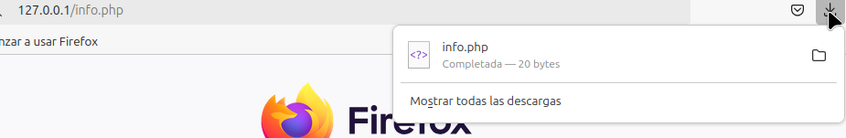
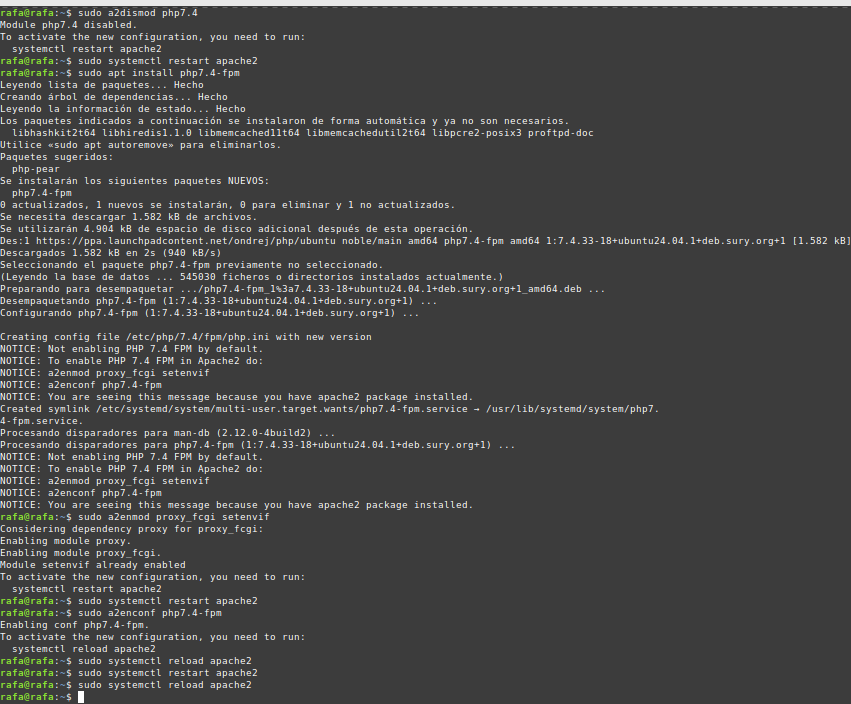

# Rafael Martín Mayor

# Instalación de LAMP en Ubuntu Server

# 1. Actualización del repositorio y paquetes
sudo apt update
sudo apt upgrade

# 2. Instalación del servidor Apache
sudo apt install apache2

# 3. Instalación del servidor de base de datos MariaDB
sudo apt install mariadb-server mariadb-client

# Comprobar el estado del servidor MariaDB
sudo systemctl status mariadb

# Habilitar el inicio automático de MariaDB
sudo systemctl enable mariadb

# Verificar la versión de MariaDB instalada
mysql --version

# Ejecutar el script de seguridad posterior a la instalación de MariaDB
sudo mysql_secure_installation

# Explicación sobre unix_socket:
# Esto significa que el servidor MariaDB está configurado para autenticar el inicio de sesión del usuario usando el socket de Unix en lugar de una contraseña.
# Esto proporciona una capa extra de seguridad al evitar el uso de contraseñas a través de conexiones TCP/IP.

# Acceder a MariaDB con la nueva contraseña
sudo mysql -u root -p

# Crear un nuevo usuario en la base de datos MariaDB
CREATE USER 'developer'@'localhost' IDENTIFIED BY '5t6y7u8i';

# Dar permisos al nuevo usuario
GRANT ALL PRIVILEGES ON *.* TO 'developer'@'localhost';

# Refrescar los privilegios
FLUSH PRIVILEGES;

# Comando para ingresar a MariaDB con el nuevo usuario
mysql -u developer -p

# 4. Instalación de PHP (versión 7.4 y módulos comunes)
sudo apt install php7.4 libapache2-mod-php7.4 php7.4-mysql php-common php7.4-cli php7.4-common php7.4-json php7.4-opcache php7.4-readline

# Activar el módulo PHP 7.4 en Apache
sudo a2enmod php7.4

# Reiniciar Apache para que los cambios surtan efecto
sudo systemctl restart apache2

# Verificar la versión de PHP instalada
php --version

# Crear el archivo info.php en el directorio raíz del servidor web
sudo vim /var/www/html/info.php

# Dentro del archivo info.php, pegar el siguiente código PHP:
# <?php phpinfo(); ?>

# Ahora acceder a la página de prueba en el navegador
# Escribe en la barra de direcciones: http://direccion-ip/info.php
# Al entrar se nos descarga el fichero info.php

# 4.1 Ejecutando código PHP con PHP-FPM
# Deshabilitar el módulo PHP 7.4 de Apache
sudo a2dismod php7.4

# Instalar PHP-FPM
sudo apt install php7.4-fpm

# Habilitar los módulos proxy_fcgi y setenvif
sudo a2enmod proxy_fcgi setenvif

# Habilitar la configuración PHP-FPM para Apache
sudo a2enconf php7.4-fpm

# Reiniciar Apache nuevamente
sudo systemctl restart apache2

# Ahora, al actualizar la página info.php, el servidor mostrará "FPM/FastCGI" en lugar de "Apache 2.0 Handler"

# CAPTURAS

