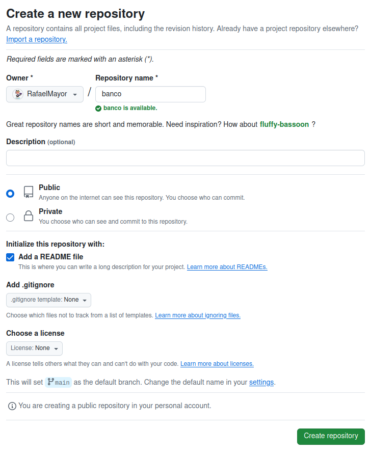

### **Rafael Martín Mayor.**

## **Tarea 1.3- Trabajando con el Visual Studio y nuestro repositorio en Github.**

Crea una cuenta en github

Ya tengo una cuenta de GitHub: <https://github.com/RafaelMayor>

Crea un repositorio llamado “banco”

Clona el repositorio desde la linea de comandos

git clone https://github.com/RafaelMayor/banco

En otra carpeta crea un proyecto llamado “banco”

Copia la carpeta del proyecto del banco a la carpeta en la que has clonado el repositorio.

Haz un commit y push desde Visual Studio.

Borrar del disco duro todo el código del banco

Borro la carpeta prueba donde tenía inicializado el repositorio banco:

rm -rf prueba

Clona el proyecto del banco de github a local

git clone https://github.com/RafaelMayor/banco

Haz una modificación del código y subelo a GitHub

Creo un index.html y lo subo a Github:

