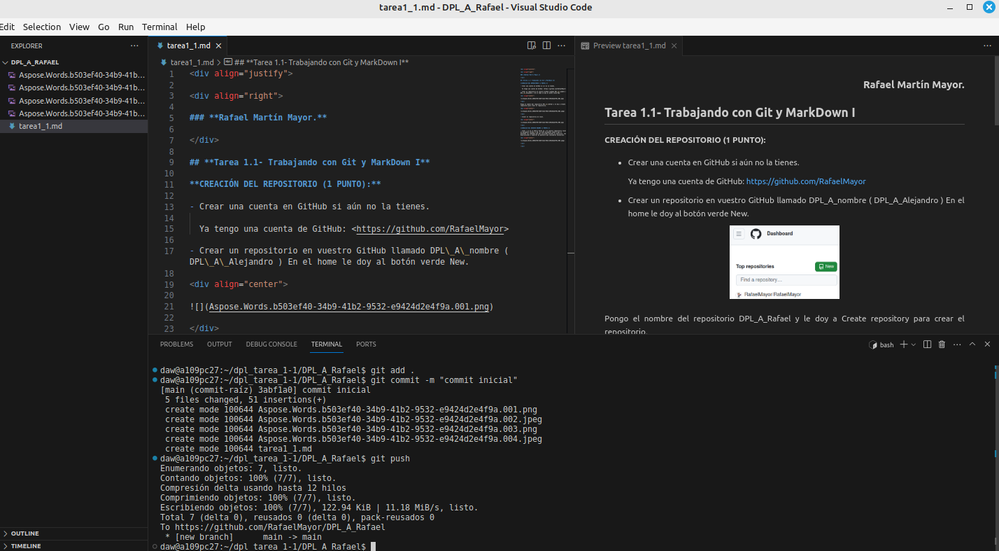
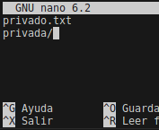

### **Rafael Martín Mayor.**

## **Tarea 1.1- Trabajando con Git y MarkDown I**

**CREACIÓN DEL REPOSITORIO (1 PUNTO):**

- Crear una cuenta en GitHub si aún no la tienes.

  Ya tengo una cuenta de GitHub: <https://github.com/RafaelMayor>

- Crear un repositorio en vuestro GitHub llamado DPL\_A\_nombre ( DPL\_A\_Alejandro ) En el home le doy al botón verde New.

Pongo el nombre del repositorio DPL\_A\_Rafael y le doy a Create repository para crear el repositorio.

- Clonar el repositorio en local.

**CREACIÓN DEL ARCHIVO README (1 PUNTO):**

- Crear ( si no lo habéis hecho ya ) en vuestro repositorio local un documento tarea1\_1.md, en este documento tendrán que ir poniendo los comandos que han utilizado durante el ejercicio, las explicaciones y capturas de pantalla que consideren necesarias.

**COMMIT INICIAL (1 PUNTO):**

- Añadir al tarea1_1.md los  comandos utilizados hasta ahora y hacer un commit inicial con el mensaje commit inicial.

**PUSH INICIAL (1 PUNTO)**

- Subir los cambios al repositorio remoto

**IGNORAR ARCHIVOS (1 PUNTO)**

- Crear en el repositorio local un fichero llamado privado.txt.

touch privado.txt

- Crear en el repositorio local una carpeta llamada privada.

mkdir privada

- Realizar los cambios oportunos para que tanto el archivo como la carpeta sean ignorados por git. ( Incluir capturas de pantalla )

touch .gitignore

nano .gitignore

En el .gitignore ponemos lo que queremos que sea ignorado por git, en este caso la carpeta privada y el fichero privado.txt:

Le damos a Ctrl + X para Salir y para guardar le damos a la S de Sí y Enter.

