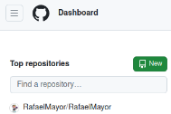
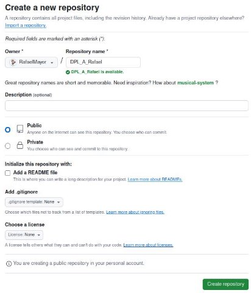
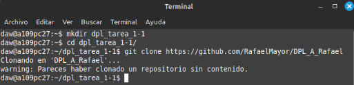
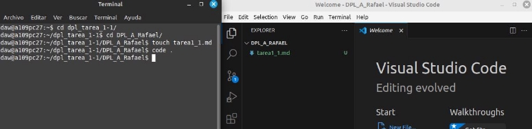

### **Rafael Martín Mayor.**

## **Tarea 1.1- Trabajando con Git y MarkDown I**

**CREACIÓN DEL REPOSITORIO (1 PUNTO):**

- Crear una cuenta en GitHub si aún no la tienes.

  Ya tengo una cuenta de GitHub: <https://github.com/RafaelMayor>

- Crear un repositorio en vuestro GitHub llamado DPL\_A\_nombre ( DPL\_A\_Alejandro ) En el home le doy al botón verde New.

Pongo el nombre del repositorio DPL\_A\_Rafael y le doy a Create repository para crear el repositorio.

- Clonar el repositorio en local.

**CREACIÓN DEL ARCHIVO README (1 PUNTO):**

- Crear ( si no lo habéis hecho ya ) en vuestro repositorio local un documento tarea1\_1.md, en este documento tendrán que ir poniendo los comandos que han utilizado durante el ejercicio, las explicaciones y capturas de pantalla que consideren necesarias.

