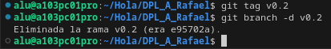

### **Rafael Martín Mayor.**

## **Tarea 1.2- Trabajando con Git y MarkDown II**

**CREAR UNA RAMA  v0.2(1 PUNTO)**

- Crear una rama v0.2.
- Posiciona tu carpeta de trabaja en esta rama.

git checkout -b v0.2

**AÑADIR  EL FICHERO 2.txt  (1 PUNTO)**

- Añadir un fichero 2.txt en la rama v0.2

touch 2.txt

git add 2.txt

git commit -m "Añadir fichero 2.txt"

**CREAR UNA RAMA REMOTA v0.2 (1 PUNTO)**

- Subir los cambios al repositorio remoto.

git push origin v0.2

**MERGE DIRECTO (1 PUNTO)**

- Posicionarse en la rama master.
- Hacer un merge de la rama v0.2 en la rama master.

git checkout main

git merge v0.2

**MERGE CON CONFLICTO (1 PUNTO)**

- En la rama master poner Hola  en el fichero 1.txt y hacer commit.
- Posicionarse en la rama v0.2 y poner Adios en el fichero 1.txt y hacer commit.
- Posicionarse de nuevo en la rama master y hacer un merge con la rama v0.2

git checkout main

echo "Hola" > 1.txt

git add 1.txt

git commit -m "Añadir Hola en 1.txt"

git checkout v0.2

echo "Adios" > 1.txt

git add 1.txt

git commit -m "Añadir Adios en 1.txt"

git checkout main

git merge v0.2

**LISTADO DE RAMAS (1 PUNTO)**

- Listar las ramas con merge y las ramas sin merge.

git branch --merged

git branch --no-merged

**ARREGLAR  CONFLICTO (1 PUNTO)**

- Arreglar el conflicto anterior y hacer un commit. Explicar como lo has arreglado incluyendo capturas de pantalla.

git add 1.txt

git commit -m "Resolver conflicto en 1.txt"

Hice un git push -f para forzar los cambios.

**BORRAR RAMA (1 PUNTO)**

- Crear un tag v0.2
- Borrar la rama v0.2

git tag v0.2

git branch -d v0.2

**LISTADO DE CAMBIOS (1 PUNTO)**

- Listar los distintos commits con sus ramas y sus tags.

git log --oneline --decorate --graph --all

