

### **Rafael Martín Mayor.**

## **Describe los pasos a realizar para alojar en Infinity free, lo que tienes en xampp**

Instalamos filezilla en la terminal con el comando:

apt install filezilla

Abrimos filezilla con el comando:

filezilla

Una vez dentro, ponemos el Host, nombre de usuario y contraseña del infinityfree, que los podemos ver una vez creada la cuenta en el file manager pinchando en el icono de la esquina superior derecha la segunda opción la del icono de servidores Log in to another server, le damos a Conexión rápida y subimos los ficheros a la carpeta htdocs:

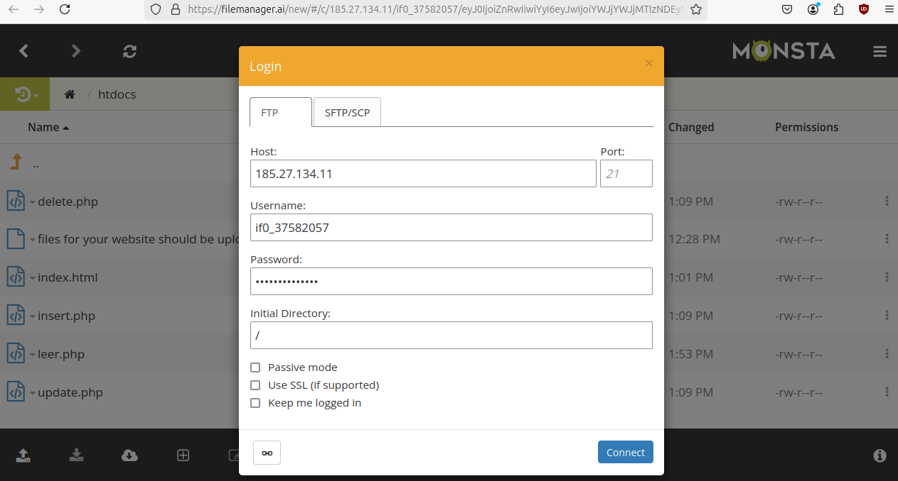

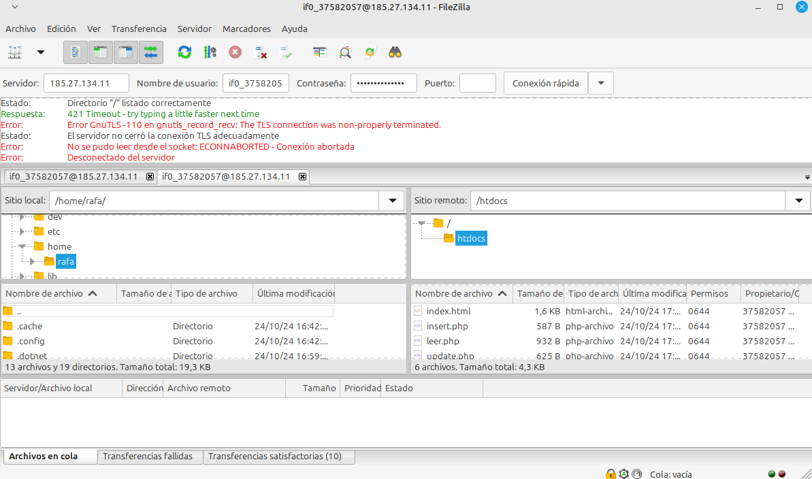

En infinityfree en la sección de Accounts MySQL Databases creamos nueva base de datos que sea idéntica a la que ya teníamos.

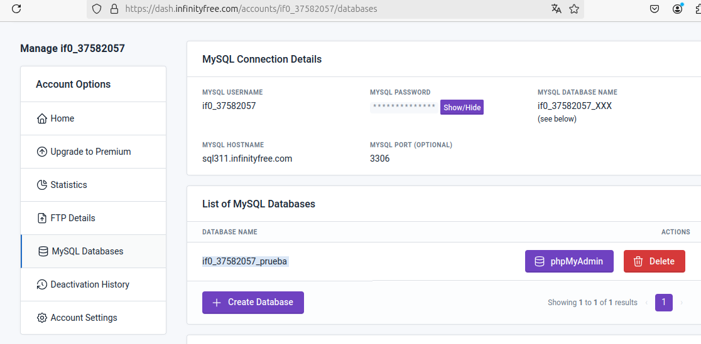

También hay que cambiar los datos de los mysqli_connect() con los datos de infinityfree y subir los ficheros modificados de nuevo al filezilla.

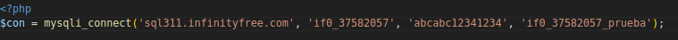

Abrimos la página y probamos que todo funcione bien:

Insertamos un usuario y le damos a Mostrar datos para ver que se haya implementado correctamente en la base de datos:

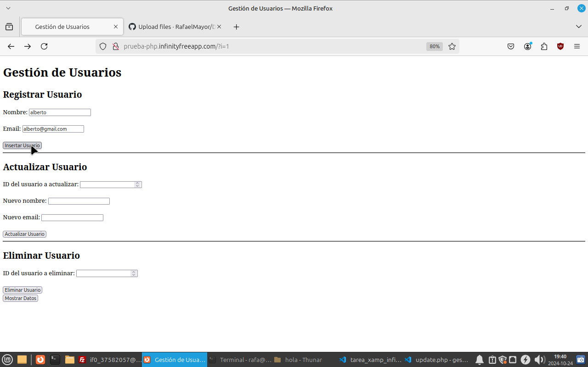

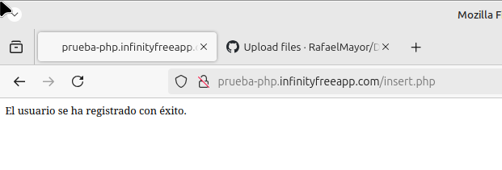

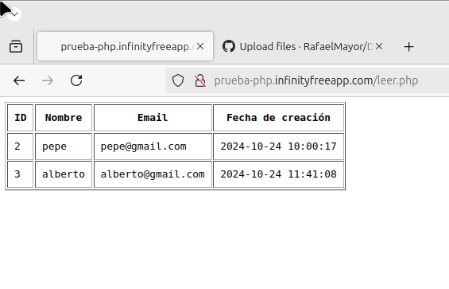

Vemos que se ha creado correctamente (el usuario pepe lo creé antes para hacer unas pruebas de que todo iba bien).

Ahora actualizamos un usuario y comprobamos que se actualice correctamente en la base de datos:

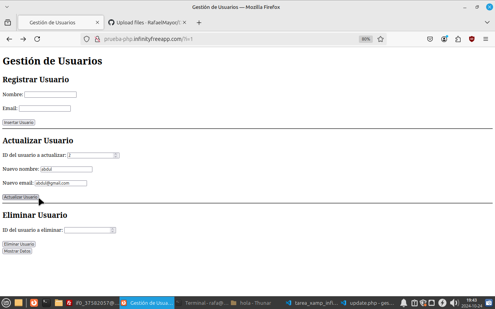

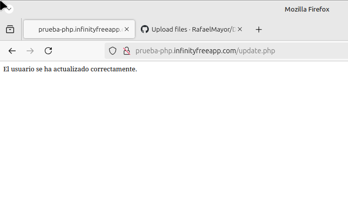

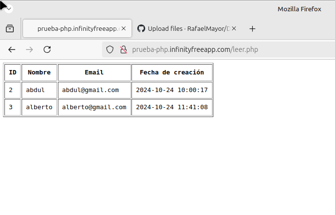

Vemos que se ha actualizado correctamente.

Ahora borramos un usuario y comprobamos que se borre correctamente en la base de datos:

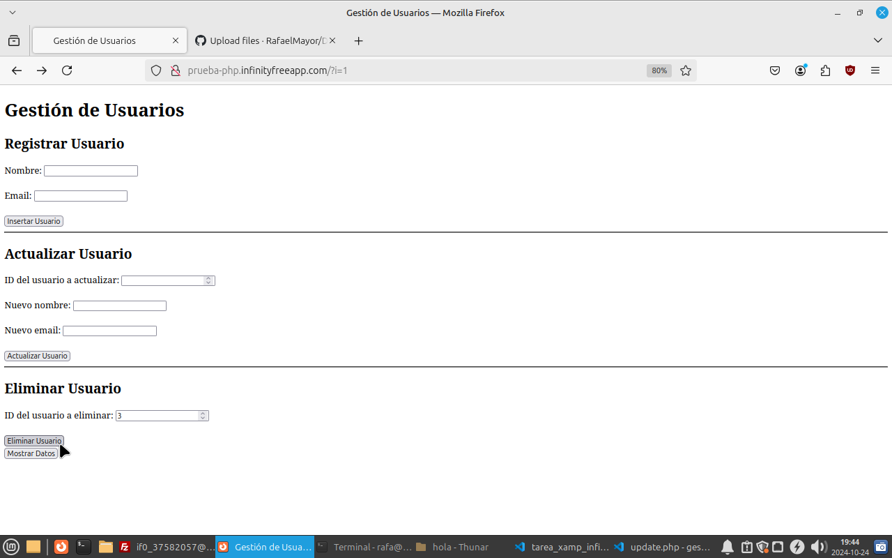

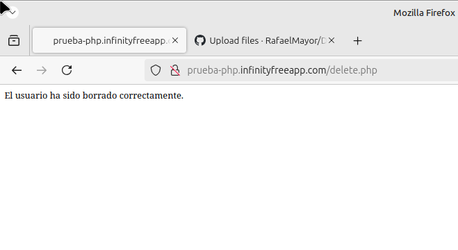

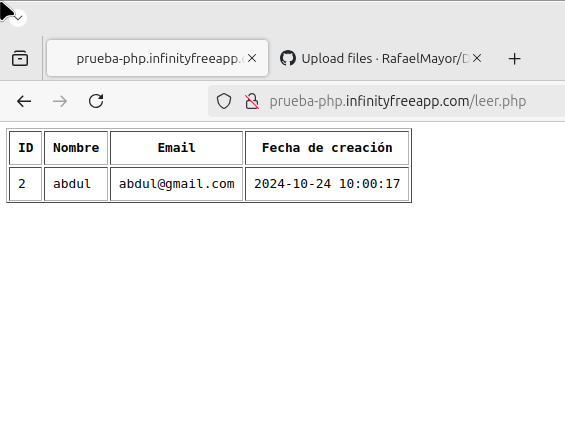

Vemos que se ha borrado correctamente.

