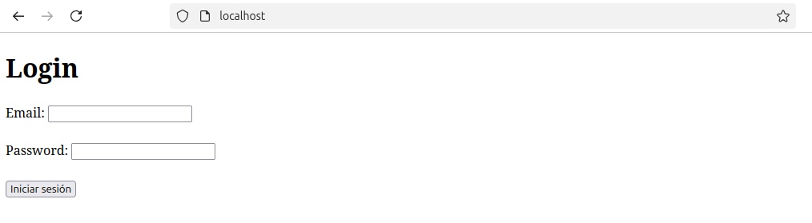

<div align='right'>

## **Rafael Martín Mayor.**

</div>

# Instalar en Lamp nuestra página implementada en xampp


Para instalar tu página en un servidor LAMP (Linux, Apache, MySQL, PHP), sigue estos pasos:

---

### **1. Configurar el entorno LAMP**
Asegúrate de tener LAMP correctamente instalado en tu servidor:

1. **Instalar Apache:**
   ```bash
   sudo apt update
   sudo apt install apache2
   ```
   Verifica que Apache esté funcionando visitando `http://localhost` en tu navegador.

2. **Instalar MySQL:**
   ```bash
   sudo apt install mysql-server
   ```
   Configura una contraseña segura para el usuario root de MySQL usando:
   ```bash
   sudo mysql_secure_installation
   ```

3. **Instalar PHP:**
   ```bash
   sudo apt install php libapache2-mod-php php-mysql
   ```

   Verifica la instalación de PHP:
   ```bash
   php --version
   ```

4. **Reiniciar Apache:**
   ```bash
   sudo systemctl restart apache2
   ```

---

### **2. Subir los archivos al servidor**
1. **Copiar los archivos:**
   Copia todos los archivos de tu proyecto a la carpeta de tu servidor Apache, normalmente ubicada en `/var/www/html`. Por ejemplo:
   ```bash
   sudo cp -r /ruta/a/tus/archivos/* /var/www/html/
   ```

2. **Asignar permisos:**
   Asegúrate de que Apache tenga los permisos necesarios:
   ```bash
   sudo chown -R www-data:www-data /var/www/html
   sudo chmod -R 755 /var/www/html
   ```

---

### **3. Configurar la base de datos**
1. **Conectar a MySQL:**
   ```bash
   sudo mysql -u root -p
   ```

2. **Crear la base de datos y la tabla `users`:**
   Ejecuta el siguiente comando en MySQL para crear la base de datos y la tabla `users`:

   ```sql
   CREATE DATABASE if0_37582057_prueba;
   USE if0_37582057_prueba;

   CREATE TABLE users (
       id INT AUTO_INCREMENT PRIMARY KEY,
       name VARCHAR(50) NOT NULL,
       email VARCHAR(100) NOT NULL UNIQUE,
       password VARCHAR(255) NOT NULL,
       role VARCHAR(20) NOT NULL,
       date TIMESTAMP DEFAULT CURRENT_TIMESTAMP
   );
   ```

3. **Insertar un usuario administrador (opcional):**
   Ejecuta `crear_admin.php` desde tu navegador para crear el usuario administrador.

---

### **4. Actualizar las credenciales de conexión**
Abre cada archivo PHP que realiza conexiones a la base de datos (`login.php`, `admin.php`, etc.) y reemplaza las credenciales de InfinityFree con las del servidor local, por ejemplo:

```php
$con = mysqli_connect('localhost', 'root', '1', 'if0_37582057_prueba');
```


### **5. Probar la aplicación**
1. Abre tu navegador y navega a `http://localhost/` para probar la página de inicio.
2. Realiza pruebas de inicio de sesión, administración de usuarios, etc.


# CAPTURAS:

